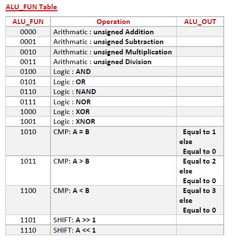

# Digital-IC-Diploma-July-2025-October-2025-
The Diploma enhanced my skills in RTL design, Functional Verification, Tcl, Synthesis, Clock Domain Crossing (CDC), power reduction techniques, Static Timing Analysis (STA), Design for Testability (DFT), Formal Verification, Place and Route (PNR), and Gate-Level Simulation (GLS).

Over the past three months (July 2025 – October 2025), I’ve been fully dedicated to expanding my knowledge and skills — and I’m excited to share that I’ve officially completed the Digital IC Design Diploma under the supervision of Eng.Ali M. Eltemsah, achieving an Excellent grade! 🎖️

The diploma was very helpful. It was divided into interactive sessions and highly valuable assignments with detailed feedback. After correcting the mistakes in each assignment, we moved on to the final project.

As shown in the repo, there are 20 assignments. Let’s go in depth for each assignment and explain how I created them.

# Assignment 1:
This is just basic training for Verilog and digital circuits. It contains sequential logic and combinational logic in always statements, and uses a modular hierarchy with each logic type in a separate always block.

it is shown in Digital-IC-Diploma-July-2025-October-2025-/tree/main/Ass1/DigCt.v

# Assignment 2:

this is UP_down_counter ,the code functionality cover all senarios 
when get down and sounter is zero
when get up and counter is max value 
when get load and up or down or both in same time what doing 

it is shown in Digital-IC-Diploma-July-2025-October-2025-/tree/main/Ass2/Up_Dn_Counter.v

# Assignment 3:

This is ALU 16 bits , the code functionality cover all scenarios no there latches 

using drawio i draw 

it is shown in Digital-IC-Diploma-July-2025-October-2025-/tree/main/Ass3/ALU_16B.v

# Assignment 4: