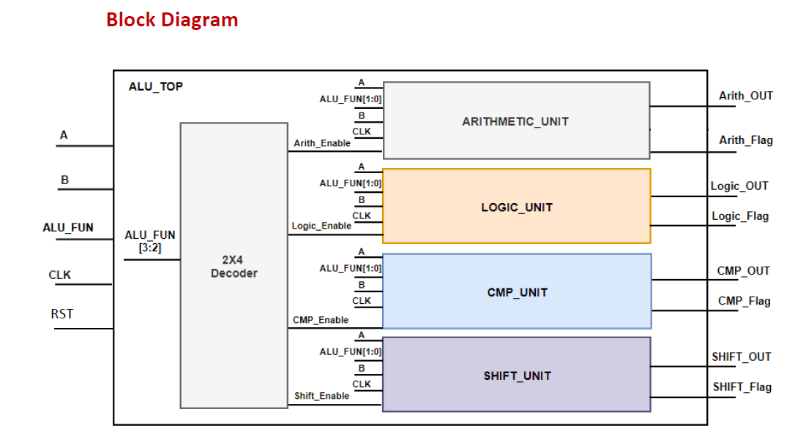
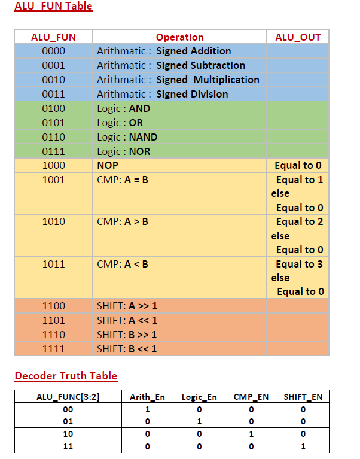
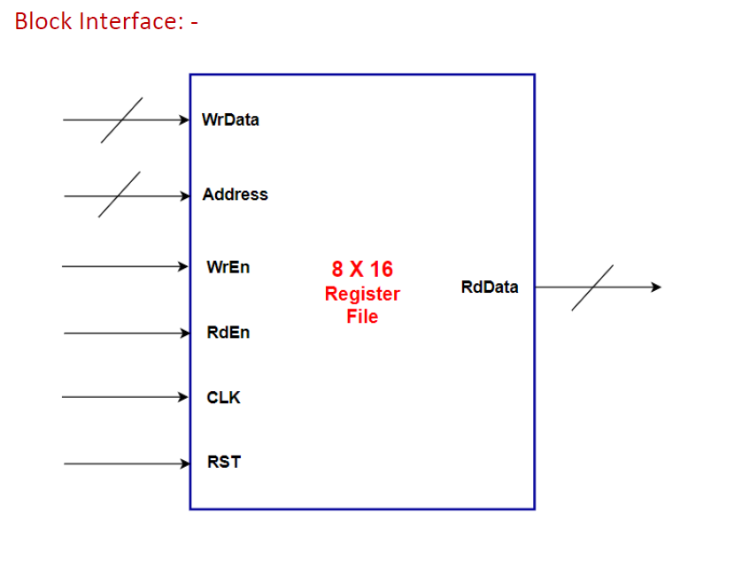
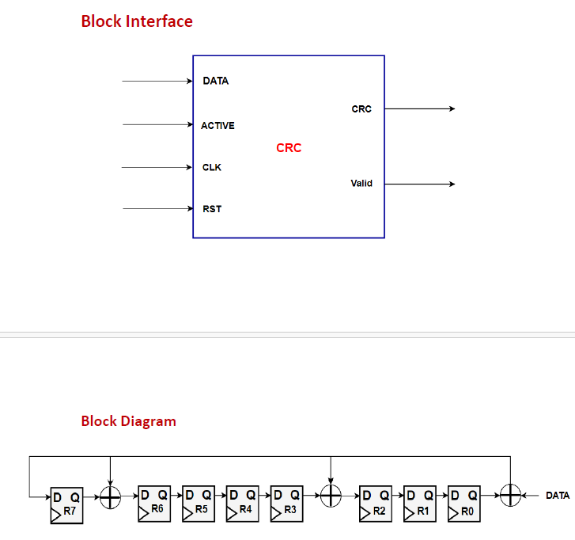
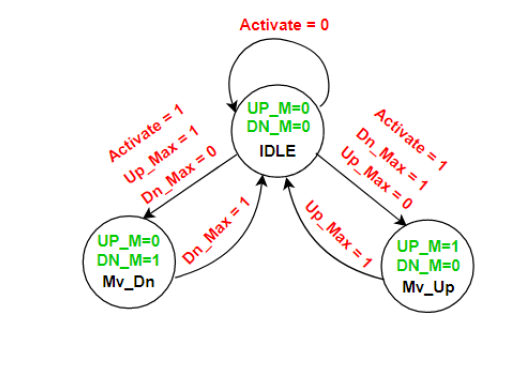

# Digital-IC-Diploma-July-2025-October-2025-
The Diploma enhanced my skills in RTL design, Functional Verification, Tcl, Synthesis, Clock Domain Crossing (CDC), power reduction techniques, Static Timing Analysis (STA), Design for Testability (DFT), Formal Verification, Place and Route (PNR), and Gate-Level Simulation (GLS).

Over the past three months (July 2025 – October 2025), I’ve been fully dedicated to expanding my knowledge and skills — and I’m excited to share that I’ve officially completed the Digital IC Design Diploma under the supervision of Eng.Ali M. Eltemsah, achieving an Excellent grade! 🎖️

The diploma was very helpful. It was divided into interactive sessions and highly valuable assignments with detailed feedback. After correcting the mistakes in each assignment, we moved on to the final project.

As shown in the repo, there are 20 assignments. Let’s go in depth for each assignment and explain how I created them.

# Assignment 1:
This is just basic training for Verilog and digital circuits. It contains sequential logic and combinational logic in always statements, and uses a modular hierarchy with each logic type in a separate always block.

it is shown in Digital-IC-Diploma-July-2025-October-2025-/tree/main/Ass1/DigCt.v

# Assignment 2:

this is UP_down_counter ,the code functionality cover all senarios 
when get down and sounter is zero
when get up and counter is max value 
when get load and up or down or both in same time what doing 
it is shown in Digital-IC-Diploma-July-2025-October-2025-/tree/main/Ass2/Up_Dn_Counter.
using drawio i draw 

# Assignment 3:

This is ALU 16 bits , the code functionality cover all scenarios no there latches 

I draw 

it is shown in Digital-IC-Diploma-July-2025-October-2025-/tree/main/Ass3/ALU_16B.v

# Assignment 4.0:
it is shown in Digital-IC-Diploma-July-2025-October-2025-/tree/main/Ass4/Ass4.0/ALU_TOP.v
after that we learn how make top module and instantation of submodules and recreate The ALU according to this diagram

And the function changes a little according to ALU_DECODER.png

# Assignment 4.1:
it is shown in Digital-IC-Diploma-July-2025-October-2025-/tree/main/Ass4/Ass4.1/Register_File.v

we create simple register module according to this diagram
A register file consists of 8 registers, each register of 16-bit width.
The register file has read data bus(RdData), write data bus(WrData) and one address bus (Address) used for both read and write operations.
Each register can be read and written by applying a register address to be accessed.
Only one operation (read or write) can be evaluated at a time.
Write Operation is done only when WrEn is high
Read operation is done only when RdEn is high.
Read and Write operations are done on positive edge of Clock
All the registers are cleared using Asynchronous active low Reset

# Assignment 5.0:
we move to CRC module to learn how Encryption made 
# Specification
1. All registers are set to LFSR Seed value using asynchronous active low reset (SEED = 8'hD8)
2. All outputs are registered
3. DATA serial bit length vary from 1 byte to 4 bytes (Typically: 1 Byte)
4. ACTIVE input signal is high during data transmission, low otherwise
5. CRC 8 bits are shifted serially through CRC output port
6. Valid signal is high during CRC bits transmission, otherwise low.
# Operation:
1. Initialize the shift registers (R7 – R0) to 8'hD8
2. Shift the data bits into the LFSR in the order of LSB first.
3. Once the last data bit is shifted into the LFSR, the registers contain the CRC bits
4. Shift out the CRC bits in the (R7 – R0) in order, R0 contains the LSB

we follow this diagram

# Assignment 5.1:
We learned The FSM and first task is Automatic Garage Door Controller with 
# Specifications: 
The Controller has 3 inputs: -
o Activate push button (user) trigger the Up motor when the Door down and trigger the Down motor when the Door Up
o UP_Max (Sensor) becomes high when the Door is completely open.
o DN_Max (Sensor) becomes high when the Door is completely close.
o Always the Door is completely close or completely open.
o Finite state machine is initialized to IDLE state using Asynchronous reset
#  States Diagram:
IDLE state: it is the default state & reset state of the finite state machine.
Mv_Up State: it is the state to enable the up motor to open the garage door
Mv_Dn state: it is the state to enable the down motor to close the garage door

designed moore fsm at 50Mhz

# Assignment 6:

Specifications
 UART TX receive the new data on P_DATA Bus only when Data_Valid Signal is high.
 Registers are cleared using asynchronous active low reset
 Data_Valid is high for only 1 clock cycle
 Busy signal is high as long as UART_TX is transmitting the frame, otherwise low.
 UART_TX couldn't accept any data on P_DATA during UART_TX processing, however Data_Valid get high.
 TX_OUT is high in the IDLE case (No transmission).
 PAR_EN (Configuration)
  0: To disable frame parity bit
  1: To enable frame parity bit
 PAR_TYP (Configuration)
  0: Even parity bit
  1: Odd parity bit

